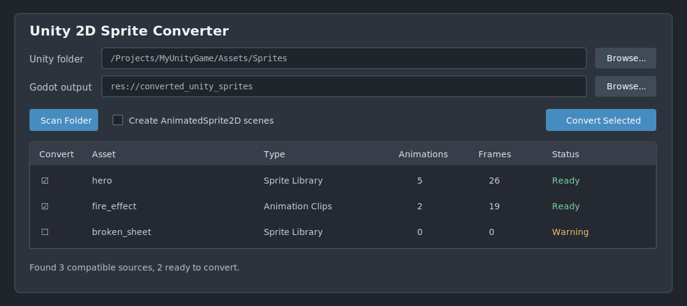

# unity2godot-sprites 한국어 매뉴얼

[English](README.md) | **한국어**

`unity2godot-sprites`는 Unity의 2D 스프라이트 시트, Sprite Library와
AnimationClip을 Godot의 `SpriteFrames` 리소스로 변환하는 Godot 4 에디터
플러그인입니다.



## 요구 사항

- Godot 4.3 이상
- Unity 텍스트 직렬화 형식의 `.meta`, `.asset`, `.anim` 파일
- Unity에서 분할 정보가 저장된 PNG 스프라이트 시트

## 먼저 체험하기

다음 명령으로 저장소를 복제합니다.

```bash
git clone --branch v0.1.1 --depth 1 \
  https://github.com/qlee3/unity2godot-sprites.git
```

Godot Project Manager에서 복제된 폴더의 `project.godot`을 가져옵니다.
프로젝트를 연 다음 아래 순서로 플러그인을 활성화합니다.

1. **Project > Project Settings > Plugins**를 엽니다.
2. `unity2godot-sprites`를 활성화합니다.
3. 에디터 아래쪽의 **Unity Sprites** 탭을 엽니다.

## 기존 Godot 프로젝트에 설치하기

저장소의 `addons/unity2godot_sprites` 폴더를 사용할 Godot 프로젝트의
`addons/` 폴더 안으로 복사합니다.

macOS 또는 Linux:

```bash
mkdir -p /path/to/your-godot-project/addons
cp -R unity2godot-sprites/addons/unity2godot_sprites \
  /path/to/your-godot-project/addons/
```

Windows PowerShell:

```powershell
New-Item -ItemType Directory -Force C:\path\to\your-project\addons
Copy-Item -Recurse unity2godot-sprites\addons\unity2godot_sprites `
  C:\path\to\your-project\addons\
```

복사 후 Godot에서 **Project > Project Settings > Plugins**를 열고
`unity2godot-sprites`를 활성화합니다.

## 변환 방법

1. **Unity folder**에서 Unity 원본 에셋 폴더를 선택합니다. Godot 프로젝트
   바깥에 있는 폴더도 선택할 수 있습니다.
2. **Godot output**에서 Godot 프로젝트 내부의 출력 폴더를 지정합니다.
   기본값은 `res://converted_unity_sprites`입니다.
3. **Scan Folder**를 눌러 변환 가능한 에셋을 검색합니다.
4. 검색 결과에서 변환할 항목을 체크합니다.
5. `AnimatedSprite2D` 씬도 필요하면 **Create AnimatedSprite2D scenes**를
   체크합니다.
6. **Convert Selected**를 누릅니다.
7. 기존 출력 파일이 있으면 목록을 확인한 후 덮어쓰기를 승인합니다.

## 출력 파일

```text
converted_unity_sprites/
  textures/    # Godot 프로젝트로 복사된 PNG
  animations/  # 생성된 SpriteFrames .tres
  scenes/      # 선택적으로 생성된 AnimatedSprite2D .tscn
```

## 지원하는 Unity 파일

플러그인은 선택한 폴더를 재귀적으로 검색해 다음 조합을 찾습니다.

- `name.png` + `name.png.meta` + `name.asset` Sprite Library
- PNG와 `.meta`, 그리고 해당 PNG의 GUID를 참조하는 `.anim` AnimationClip

AnimationClip의 프레임 순서, FPS와 반복 설정은 유지됩니다. Unity와 Godot의
스프라이트 좌표계 차이도 변환 과정에서 자동으로 보정합니다.

현재 버전은 Prefab, Animator Controller, Tilemap, 머티리얼, 오디오, 3D
에셋과 Unity 바이너리 직렬화 형식을 지원하지 않습니다.

## 문제 해결

### Unity Sprites 탭이 보이지 않음

**Project > Project Settings > Plugins**에서 플러그인이 활성화되어 있는지
확인합니다. 설치 후 Godot 에디터를 다시 열어야 할 수도 있습니다.

### 검색 결과가 나오지 않음

PNG 옆에 `.png.meta` 파일이 있는지 확인합니다. Sprite Library 변환에는
동일한 기본 이름의 `.asset` 파일이 필요하며, AnimationClip은 PNG 메타데이터의
GUID를 참조해야 합니다.

### 출력 폴더 오류가 발생함

출력 경로는 반드시 현재 Godot 프로젝트 내부의 `res://` 경로여야 합니다.

## 업데이트

새 버전을 다시 클론한 뒤 `addons/unity2godot_sprites` 폴더를 기존 설치
폴더에 덮어씁니다. 덮어쓰기 전에 Godot 에디터를 닫는 것을 권장합니다.

## 라이선스

MIT 라이선스입니다. 자세한 내용은 [LICENSE](LICENSE)를 참고하세요. 이
저장소에는 제3자 Unity 에셋 팩이 포함되어 있지 않습니다.
